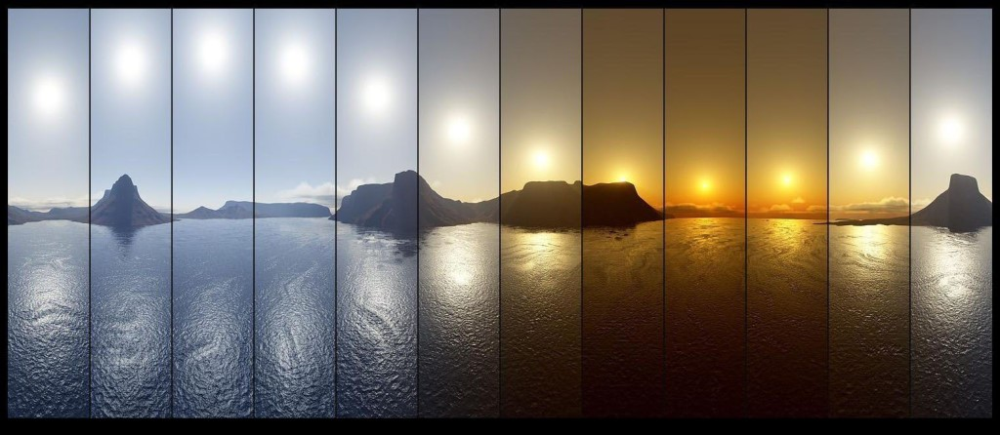
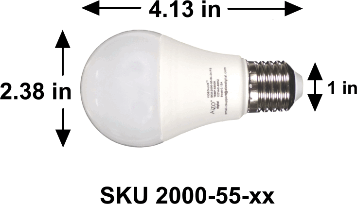

# 基于物理的光照（Physically Based Lighting）

## 真实世界中的光源

基于物理的光照符合真实世界中的光源描述，在真实环境中，我们所见到的光源产品都具有自身的工业参数，我们先来看一个宜家的灯泡💡

从产品包装上，我们可以了解到这个灯泡的几个重要工业参数：
- **功率**
- **色温**
- **尺寸**

这三个重要参数影响真实世界中的光源表现效果，下面我们来重点讲解一下这三个参数的物理意义。

---

## 发光功率

发光功率就是我们通常所说的光源强度。Cocos 3D 中使用 **光学度量单位（Photometric Unit）** 来计量光源强度：
- **发光功率（Luminous Power）** ：单位 **流明（*lm*）** 
  描述光源从各个方向发出的光的总量。改变光源大小不会影响场景照明效果
- **亮度（Luminance）** ：单位 **坎德拉每平方米（*cd/m2*）** 
  描述光线从光源表面上的点入射到接收表面上点，所具有的光源强度。改变光源大小会影响场景照明效果
- **照度（Illuminance）** ：单位 **勒克斯（*lx*）** 
  描述光线从光源入射到接收表面处的光的总量。该值受光的传播距离影响。

在真实世界中，由于描述光源的重要物理参数不一样，我们通常用 **发光功率（Luminous Power）** 和 **亮度（Luminance）** 来描述生活中常见的带有照明面积的光源，用 **照度（Illuminance）** 来描述太阳光。

---

## 色温（ColorTemperature）

**色温**：是指绝对黑体从绝对零度(-273℃)开始加温后所呈现的颜色。

色温是影响光源颜色的重要属性，是个可选属性，当启用色温时，色温也参与了光源颜色的组成部分。

真实世界环境中，一天不同时段的环境色温也会动态发生变化： 

可参考下表所示： 

---

## 光源大小

真实世界中的光源都具有真实的物理尺寸，同时，光源大小也影响了光源强度。

---

继续前往 [主方向光](dir-light.md) 说明文档。
