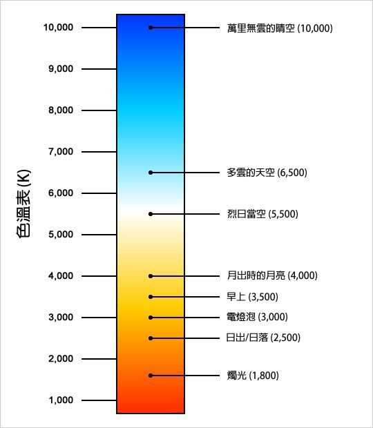

# 光源

光源在游戏中表示具备发光能力的物体，并且能够照亮周围的环境

Cocos 3D 中采用光学度量单位来描述光源参数。基于光学度量单位，我们可以将光源的相关参数全部转化为真实世界中的物理值。这样，设计人员可根据相关灯光的工业参数以及真实环境的实际物理参数来调节光照强度、颜色、范围等信息，使整体光照效果更加符合真实的自然环境。

Cocos 3D 中支持三种类型的光源：
- **方向光（Directional Light）**
- **球面光（Sphere Light）**
- **聚光灯（Spot Light）**

---

## 主方向光（Main Directional Light）

Cocos 3D 中只有一个主方向光，主方向光可以理解为场景中的主导性光源，通常是室外场景的太阳光。主方向光还会影响阴影的投影。

| 参数名称 | 说明 |
|:-------:|:---:|
| Color | 光源颜色 |
| UseColorTemperature | 是否启用色温 |
| ColorTemperature | 色温 |
| Illumiance | 照度，单位**勒克斯（lx）** |

---

## 球面光（Sphere Light）

Cocos 3D 中使用球面光替代 **点光源（Point Light）**，因为真实世界中的物理光源都具有光源大小属性。

| 参数名称 | 说明 |
|:-------:|:---:|
| Color | 光源颜色 |
| UseColorTemperature | 是否启用色温 |
| ColorTemperature | 色温 |
| Size | 光源大小 |
| Range | 光照影响范围 |
| Term | 选用的光照强度单位术语 球面光支持两种单位制系统：**发光功率（LUMINOUS_POWER）** 和 **亮度（LUMINANCE）** |
| LuminousPower | 发光功率，单位**流明（lm）** 当 Term 指定为 LUMINOUS_POWER 时，选用流明来表示光照强度 |
| Luminance | 亮度，单位**坎德拉每平台米（cd/m2）** 当 Term 指定为 LUMININANCE 时，选用亮度来表示光照强度 |

---

## 聚光灯（Spot Light）

| 参数名称 | 说明 |
|:-------:|:---:|
| Color | 光源颜色 |
| UseColorTemperature | 是否启用色温 |
| ColorTemperature | 色温 |
| Size | 光源大小 |
| Range | 光照影响范围 |
| SpotAngle | 聚光角度 |
| Term | 选用的光照强度单位术语 聚光灯支持两种单位制系统：**发光功率（LUMINOUS_POWER）** 和 **亮度（LUMINANCE）** |
| LuminousPower | 发光功率，单位**流明（lm）**。 当 Term 指定为 LUMINOUS_POWER 时，选用流明来表示光照强度 |
| Luminance | 亮度，单位**坎德拉每平台米（cd/m2）**。 当 Term 指定为 LUMININANCE 时，选用亮度来表示光照强度 |

---

## 色温（ColorTemperature）

**色温**：是指绝对黑体从绝对零度(一273℃)开始加温后所呈现的颜色。

色温是影响光源颜色的重要属性，是个可选属性，当启用色温时，色温也参与了光源颜色的组成部分。

真实世界环境中的色温可参考下表所示：

