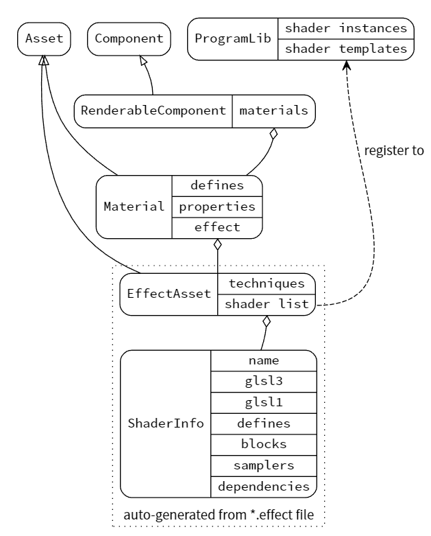

# 材质系统总览

材质系统控制着每个模型最终的着色流程与顺序, 在引擎内相关类间结构如下:
[](material.dot)

## EffectAsset
EffectAsset 是由用户书写的着色流程描述文件, 详细结构及书写指南可以参考[这里](effect-syntax.md).<br>
这里主要介绍引擎读取 EffectAsset 资源的流程:

在编辑器加载 EffectAsset 时, 会对用户书写的内容做一次预处理, 替换 GL 字符串为管线内常量, 提取 shader 信息, 转换 shader 版本等.<br>
还以 skybox.effect 为例, 预处理输出的 EffectAsset 结构是这样的:
```json
  {
    "name": "builtin-effect-skybox",
    "techniques": [{"passes":[{"rasterizerState":{"cullMode":0}, "depthStencilState":{"depthTest":true, "depthWrite":false}, "program":"builtin-effect-skybox|sky-vs:vert|sky-fs:frag", "properties":{"cubeMap":{"type":32, "value":"default-cube"}}, "priority":10}]}],
    "shaders": [
      {
        "name": "builtin-effect-skybox|sky-vs:vert|sky-fs:frag",
        "glsl3": {
          "vert": "// glsl 300 es vert source, omitted here for brevity",
          "frag": "// glsl 300 es frag source, omitted here for brevity"
        },
        "glsl1": {
          "vert": "// glsl 100 vert source, omitted here for brevity",
          "frag": "// glsl 100 frag source, omitted here for brevity"
        },
        "defines": [
          {"name":"USE_RGBE_CUBEMAP", "type":"boolean", "defines":[]}
        ],
        "blocks": [],
        "samplers": [
          {"name":"cubeMap", "type":32, "count":1, "defines":[], "binding":0}
        ],
        "dependencies": {}
      }
    ]
  },
```
接着这个生成的 EffectAsset 正常参与标准(反)序列化流程.<br>
另外在反序列化时, 其中包含的 shaders 会被直接注册到 ProgramLib, 供运行时使用.

## Material
Material 资源可以看成是 EffectAsset 在场景中的资源实例, 它本身的可配置参数有:
* EffectAsset 资源引用: 使用哪个 EffectAsset 所描述的流程进行渲染? (必备)
* 使用 EffectAsset 中的第几个 technique? (默认为 0 号)
* define 宏定义列表: 需要开启哪些宏定义? (默认全部关闭)

有了这些信息后, Material 就可以被正确初始化(标志是生成渲染使用的 Pass 对象数组), 用于具体模型的渲染了.<br>
注意如果在 Material 初始化后需要改变以上参数, 需要销毁重建 Material 资源.

接着根据 EffectAsset 的信息, 可以进一步对每个 Pass 设置 uniform 参数等. 这些值都是在逐资源层面区分, 还并不涉及场景.<br>
Material 通过挂载到 RenderableComponent 上与场景连接, 所有需要设定材质的 Component (ModelComponent, SkinningModelComponent等) 都继承自它.<br>
一个 Material 可以挂载到任意多个 RenderableComponent 上, 根据子模型的数量, RenderableComponent 也可引用多个 Material 资源.<br>
当场景中的某个模型的 Material 需要特化的设置, 会在从 RenderableComponent 获取 Material 时自动做拷贝实例化.
