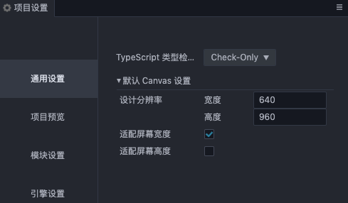
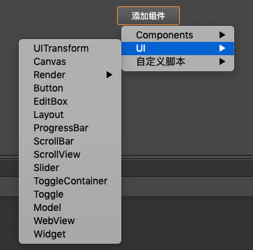

# UI 结构说明

UI 采用的是基于树状的渲染结构，整个 UI 的渲染都是基于 Canvas 节点（带有 CanvasComponent 的节点）作为根节点来进行，也就是 UI 节点的最终根节点必须是 Canvas 节点才可以被该 Canvas 渲染。每一个 UI 节点必须带有 UITransformComponent 组件以作为点击或者对齐策略等生效的必要条件。

在整体渲染方面，UI 采用了一套独立的渲染管线且优先级是最高的，整个渲染管线会先渲染完 3D 部分再渲染 UI。同时，UI 又通过 Canvas 节点的 CanvasComponent 组件上的 priority 来决定渲染的先后。

UI 还支持对模型进行渲染，唯一的条件是必须对带有模型组件（例如：ModelComponent / SkinningModelComponent）的节点添加 **UI/Model** 组件才可以和 UI 在相同的管线上进行渲染。

渲染数据组织以及流程如下：

# UI 入门

UI 是游戏开发的必要交互部分，一般游戏上的按钮、文字、背景等一般都是通过 UI 来制作的。在我们开始一款 UI 的制作时，一般会先要确定当前设计的显示内容（设计分辨率）大小是多少，可以通过以下方式来设置。

在定制好了设计分辨率之后，接下来开始创建 UI 元素。所有的 UI 元素都包含在 Canvas 节点下，可以在场景管理面板下通过右键 ***创建/UI/Canvas*** 来获取 UI 元素的根节点。Canvas 节点上有一个 CanvasComponent 组件，该组件内部会主动创建一个 camera，同时，在 [CanvasComponent](../editor/canvas.md) 上有属性 RenderMode，可以通过调整模式来实现真正意义上的 3D 相机与 2D 相机的穿插渲染。当然，在一个场景下，也可以存在多个 Canvas 节点，但是 Canvas 节点不应该嵌套在另一个 Canvas 节点或其子节点下，这个是希望大家知道的信息，接着可以通过 CanvasComponent 上的 priority 参数来调整多个 Canvas 之间的显示优先级。这里还要多说一句，修改 priority 的最终生效是在运行时，编辑器下还是按照 Canvas 节点的先后来显示渲染内容。

在说明完了 UI 的关键内容后，接下来就可以在 Canvas 节点下按照项目设计结构安置 UI 节点了。默认自带的 UI 节点有以下几种：

可以通过选中节点，在属性检查面板添加组件部分 UI 下查看组件的功能。Render 分组内的组件都是属于 UI 渲染组件，其余都是属于 UI 功能组件。

渲染组件的先后顺序也是遵循一定的规则，采用广度排序方案，也就是 Canvas 节点下的子节点的排序先后就已经决定了往后的整个[渲染规则](priority.md)，可以通过渲染组件上的 priority 属性修改渲染排序，对于没有渲染组件的节点可以通过添加 UIReorderComponent 组件来添加一个只带有排序功能的组件来进行排序。

在一般的游戏开发中，必要的 UI 元素一般是 Sprite（精灵图），Label（文字），Mask（遮罩），Widget（对齐），Layout（布局）等。其中 Sprite 和 Label 的意思都比较明确，就是渲染图片和文字；Mask 主要用于限制显示内容，比较常用的地方是一些聊天框和背包等；Layout 主要用于显示排布，一般用于按钮单一排布，背包内道具整齐排布等；最后一个比较重要的功能其实是 Widget，主要用于显示对齐，这里可能涉及到另外一个功能，那就是多分辨率适配的问题，在我们设计完 UI 需要发布到不同平台的时候势必会出现平台的实际设备分辨率和我们的设计分辨率不符的情况，这个时候为了适配则不得不做一些取舍，比如头像框，是不能做缩放的，但是我们又希望它没有很大程度受设备影响，那么我们则需要为它添加上 Widget 组件，并且始终保证它对齐在我们的设计分辨率的左上方，具体参考：[对齐策略](widget-align.md)和[对齐](../editor/widget.md)。

当我们的界面制作完成之后，可能有人会发现，怎么发布 Iphone7 和 IphoneX 的显示效果不一样，这个其实也是我们上面提到的设备分辨率的问题。在你以设计分辨率设计，最终以设备分辨率发布的时候，因为不同型号的手机设计分辨率可能不一致，这中间存在像素偏差的问题，因此，还需要做的一道转换工序那就是屏幕适配。通过最上面的 ***项目设置*** 设计分辨率更改页面可以看到，还有两个选项是 ***适配屏幕宽度/适配屏幕高度***，按照 Cocos Creator 3D 提供的屏幕适配规则以及结合上 Widget 组件，就可以实现不同设备的轻松适配，具体适配说明请参照：[多分辨率适配方案](multi-resolution.md)。

# UI 规则介绍

- [渲染排序规则](priority.md)
- [多分辨率适配方案](multi-resolution.md)
- [对齐策略](widget-align.md)
- [文字排版](label-layout.md)
- [自动布局容器](auto-layout.md)
- [制作动态生成内容的列表](list-with-data.md)
- [制作可任意拉伸的 UI 图像](sliced-sprite.md)
- [UI 静态合批组件](../editor/ui-batch.md)
