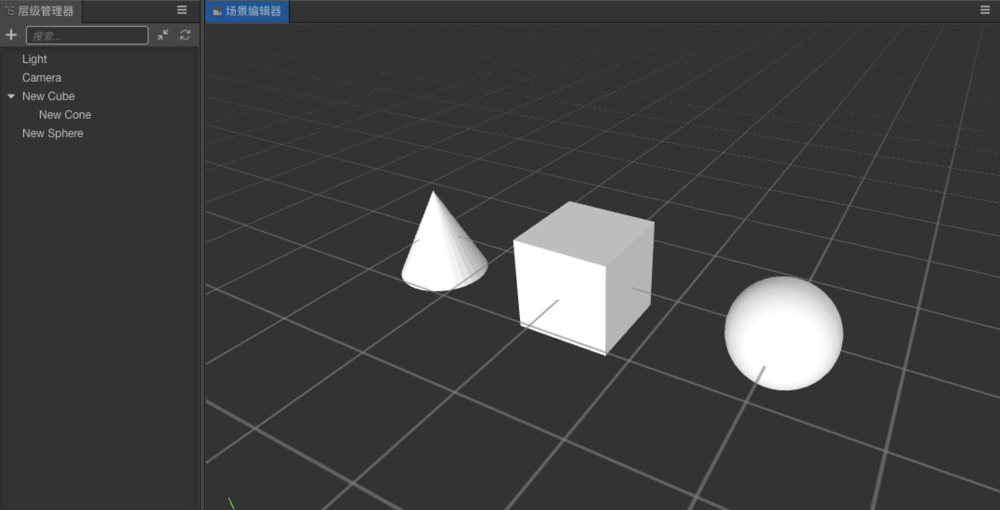
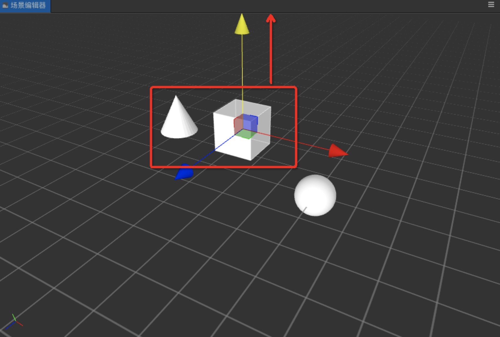

# 节点的层级

通过前面的内容，我们了解了通过节点和组件的组合，能够在场景中创建各种逻辑和渲染元素。当场景中的元素越来越多时，我们就需要通过节点层级来将节点按照逻辑功能归类，通过节点层级我们可以很方便的批量操作一组节点变换、删除，或是按需要隐藏和展示他们。

## 了解层级管理器

创建和编辑节点时，**场景编辑器** 可以展示直观的可视化场景元素。而节点之间的层级关系则需要使用 **层级管理器** 来检查和操作。请先阅读[层级管理器](../getting-started/basics/editor-panels/node-tree.md)面板介绍，来掌握 **层级管理器** 的使用方法。

## 节点树与变换

通过层级管理器或运行时脚本的操作，建立的节点之间的完整逻辑关系，就叫做节点树。

下面是一个简单的3D场景，场景中除了灯光和相机，只包含**立方体（Cube）**、**圆锥体（Cone）**、**球体（Sphere）**，它们的节点关系如图所示：

Cube与Sphere是根节点，它们没有父节点，Cone是Cube的子节点，这意味着Cone的变换属性是相对于Cube的变换，并且在变换Cube时，Cone也会跟着Cube变换。例如，向上平移Cube时，Cone也会跟着平移。

